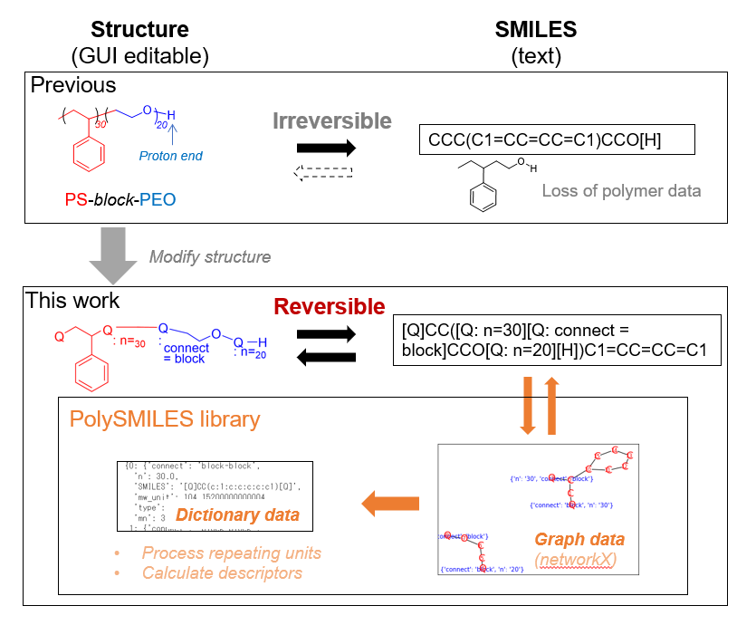

# PolySMILES
- A module to process polymer information, written in SMILES format 

# What can be done?


# Install
- pip install git+https://github.com/KanHatakeyama/polySMILES.git
- RDKit and networkX are required

# Notes
- This module works on "pysmiles" library
 - https://pypi.org/project/pysmiles/

# Todo
- Implement graph neural nets to process the polymer data

# History
- version 2021.3.18
- version 2021.5.04
	- Impllement fingerprint and JRGUI, change interfaces

# Author
- Kan Hatakeyama-Sato
- Waseda University
- https://kanhatakeyama.github.io/
- http://www.appchem.waseda.ac.jp/~polymer/PolymerDatabase/


```python

```
